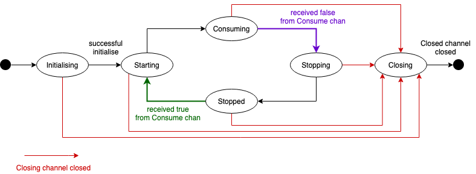
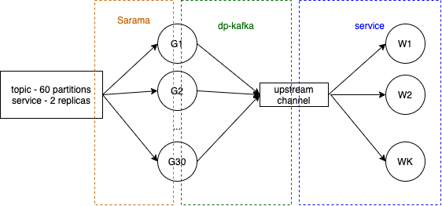

# dp-kafka

Kafka client wrapper using channels to abstract kafka consumers and producers. This library is built on top of [Sarama](https://github.com/Shopify/sarama)

## Configuration

By default, the library assumes plaintext connections,
unless the configuration argument has a non-nil `SecurityConfig` field.

### Setup app to use TLS

> Amazon Managed Streaming for Apache Kafka (Amazon MSK) is a fully managed service that enables you to build and run applications that use Apache Kafka to process streaming data.
  
As of 2021, our apps have migrated from running our own Kafka to using Amazon MSK as it provides the control-plane operations, such as those for creating, updating, and deleting clusters and
lets you use Apache Kafka data-plane operations, such as those for producing and consuming data.

To use TLS, please do the following:

#### 1. Add kafka topics to manifest

First of all, we need to update the manifest of the app to contain the kafka topics which the app uses. This is done as follows:

1. Create feature branch for the upcoming changes to the manifest of the app in [`dp-configs`][dp-configs]
2. In the [manifest of the app][dp-configs-manifests], add the revelant kafka topics at the end of the file as follows

  ```yml
  kafka:
    topics:
      - name: `topic name 1` (e.g. `content-published`)
        subnets: [ `web` or `publishing` or both `web, publishing` ]
        access: [ `read` or `write` ]
      - name: `topic name 2` 
        subnets: [ `web` or `publishing` or both `web, publishing` ]
        access: [ `read` or `write` ]
  ```

   More details of kafka section can be found [here][kafka-section-detail]

   **An example of adding kafka topics to the manifest can be found [here][manifest-example]**
3. `Review` and `merge` these changes to continue with the [next step](#create-client-certificate-for-the-app---run-key-admin-script)

#### 2. Create client certificate for the app - Run `key-admin` script

Next, we need to create a *client certificate* for the app so that
it can connect and authenticate using `TLS` and its client certificate.
This can be achieved by running the `key-admin` script.
  
**Notes:**

1. The `key-admin` script checks the manifests of the apps in [`dp-configs`][dp-configs] to see whether a client certificate needs to be created for the app (by checking whether any kafka topics are mentioned in the manifest). Therefore, please make sure that your local machine is on the **`master`** branch for [`dp-configs`][dp-configs] which contains all your changes from the [previous step](#add-kafka-topics-to-manifest).
2. Remember to do *Step 4* of the [Client Certificate README][client-cert-readme] to inject the relevant certificate details into the app's secrets (using the `--secrets` argument) unless the app is being [migrated to AWS MSK](MIGRATING.md) in which case this step is done later
3. Please remember to come back to this README after completing this task to continue with the process.
  
**Follow the steps explained in the [Client Certificate README][client-cert-readme] to run `key-admin`**

#### 3. Apply kafka topics to AWS MKS - Run `topic-manager` script

Next, we need to create the kafka topics - used by the app - on AWS MSK. This can be achieved by running the `topic-manager` script. Running the script informs AWS MSK of:

- any new topics (topic manager creates them)
- new clients/apps (i.e. certs) using the service:
  - topic manager authorises the clients/apps (i.e. certs) to gain the right access (read and/or write) to its topics
  - renewed certs do not need a re-run of topic manager

**Notes:**

1. The `topic-manager` script checks the manifests of the apps in [`dp-configs`][dp-configs] to see if any changes to kafka topics (adding or deleting topics) need to be applied to AWS MSK by checking the kafka topics mentioned in the manifest. Therefore, please make sure that your local machine is on the **`master`** branch for [`dp-configs`][dp-configs] which contains all your changes from the [previous step](#add-kafka-topics-to-manifest).
2. Please remember to come back to this README after completing this task to continue with the process.
  
**Follow the steps explained in the [Kafka Setup Tools README][kafka-setup-tools-readme] to run `topic-manager`**

#### 4. Add configs in the app to use AWS MSK

Once the components (in previous steps) have been setup for the app to use TLS,
the app itself needs to be updated to use TLS. To achieve this, please do the following:

1. Update the app `README.md` to include kafka configurations to connect to AWS MSK using TLS

   ```markdown
   | Environment variable         | Default                                   | Description
   | ---------------------------- | ----------------------------------------- | -----------
   | KAFKA_ADDR                   | localhost:9092                            | The kafka broker addresses (can be comma separated)
   | KAFKA_VERSION                | "1.0.2"                                   | The kafka version that this service expects to connect to
   | KAFKA_SEC_PROTO              | _unset_                                   | if set to `TLS`, kafka connections will use TLS [[1]](#notes_1)
   | KAFKA_SEC_CA_CERTS           | _unset_                                   | CA cert chain for the server cert [[1]](#notes_1)
   | KAFKA_SEC_CLIENT_KEY         | _unset_                                   | PEM for the client key [[1]](#notes_1)
   | KAFKA_SEC_CLIENT_CERT        | _unset_                                   | PEM for the client certificate [[1]](#notes_1)
   | KAFKA_SEC_SKIP_VERIFY        | false                                     | ignores server certificate issues if `true` [[1]](#notes_1)
   
   **Notes:**

       1. <a name="notes_1">For more info, see the [kafka TLS examples documentation](https://github.com/ONSdigital/dp-kafka/tree/main/examples#tls)</a>
   ```

2. Add the configurations to `config.go`

   ```go
   // KafkaTLSProtocolFlag informs service to use TLS protocol for kafka
   const KafkaTLSProtocolFlag = "TLS"
   ```

   ```go
   type Config struct {
        // TO-REMOVE: this struct already contains other configs in the app but update this struct accordingly with the following organised layout
        KafkaConfig                KafkaConfig
    }

    // KafkaConfig contains the config required to connect to Kafka
    type KafkaConfig struct {
        Brokers                  []string `envconfig:"KAFKA_ADDR"                            json:"-"`
        Version                  string   `envconfig:"KAFKA_VERSION"`
        SecProtocol              string   `envconfig:"KAFKA_SEC_PROTO"`
        SecCACerts               string   `envconfig:"KAFKA_SEC_CA_CERTS"`
        SecClientKey             string   `envconfig:"KAFKA_SEC_CLIENT_KEY"                  json:"-"`
        SecClientCert            string   `envconfig:"KAFKA_SEC_CLIENT_CERT"`
        SecSkipVerify            bool     `envconfig:"KAFKA_SEC_SKIP_VERIFY"`
    }
   ```

   ```go
   // TO-REMOVE: set the default values of the kafka configs in the Get() as the following
   KafkaConfig: KafkaConfig{
            Brokers:                  []string{"localhost:9092"},
            Version:                  "1.0.2",
            SecProtocol:              "",
            SecCACerts:               "",
            SecClientCert:            "",
            SecClientKey:             "",
            SecSkipVerify:            false,
    },
   ```

3. Update the test to check config default values in `config_test.go` accordingly

   ```go
   So(cfg.KafkaConfig.Brokers[0], ShouldResemble, []string{"localhost:9092"})
   So(cfg.KafkaConfig.Version, ShouldEqual, "1.0.2")
   So(cfg.KafkaConfig.SecProtocol, ShouldEqual, "")
   So(cfg.KafkaConfig.SecCACerts, ShouldEqual, "")
   So(cfg.KafkaConfig.SecClientCert, ShouldEqual, "")
   So(cfg.KafkaConfig.SecClientKey, ShouldEqual, "")
   So(cfg.KafkaConfig.SecSkipVerify, ShouldBeFalse)
   ```
  
   **An example of adding kafka configs to the app can be found [here][app-kafka-config-example]**
  
4. Continue to the next step in the [Creation of Kafka Producer and/or Consumer](#creation)

## Creation

Kafka producers and consumers can be created with constructors that accept the required configuration. You may get the channels struct using `producer.Channels()` and `consumer.Channels()` respectively.

For optional config values, the Sarama default config values will be used unless an override is provided. If a compulsory value is not provided, the config validation will fail, and the error will be returned by the constructor function.

The constructor tries to initialise the producer/consumer by creating the underlying Sarama client, but failing to do so will not result in an error: an uninitialised consumer/producer will be returned instead.

### Producer creation

The producer constructor accepts a configuration. The configuration needs to provide at least Brokers and ProducedTopic. You may also provide overrides for default Sarama configs, like `KafkaVersion` or `MaxMessageBytes`, and/or a SecurityConfig as described in the previous section.

```go
    // Create Producer with config
    pConfig := &kafka.ProducerConfig{
        BrokerAddrs:     kafkaConfig.Brokers,       // compulsory
        Topic:           kafkaConfig.ProducedTopic, // compulsory
        KafkaVersion:    &kafkaConfig.Version,
        MaxMessageBytes: &kafkaConfig.MaxBytes,
    }
    if kafkaConfig.SecProtocol == config.KafkaTLSProtocolFlag {
        pConfig.SecurityConfig = kafka.GetSecurityConfig(
            kafkaConfig.SecCACerts,
            kafkaConfig.SecClientCert,
            kafkaConfig.SecClientKey,
            kafkaConfig.SecSkipVerify,
        )
    }
    producer, err := kafka.NewProducer(ctx, pConfig)
```

### ConsumerGroup creation

The consumerGroup constructor accepts a configuration. The configuration needs to provide at least Brokers, Topic and GroupName. You may also provide overrides for default Sarama configs, like `KafkaVersion` or `MaxMessageBytes`, and/or a SecurityConfig as described in the previous section.

For concurrent consumers, you can override `NumWorkers` config (default is 1), which determine the number of go-routines that will handle messages.

For batch consumers, you can override `BatchSize` (default is 1) and `BatchWaitTime` (default is 200 ms), which determine the maximum number of kafka messages stored in a batch, and the maximum time to wait until the batch is processed, respectively, and/or a SecurityConfig as described in the previous section.

The constructor will create an Upstream channel with a buffer size that is the maximum between `BatchSize` and `NumWorkers`

```go
    // Create ConsumerGroup with config
    cgConfig := &kafka.ConsumerGroupConfig{
        BrokerAddrs:  kafkaConfig.Brokers,       // compulsory
        Topic:        kafkaConfig.ConsumedTopic, // compulsory
        GroupName:    kafkaConfig.ConsumedGroup, // compulsory
        KafkaVersion: &kafkaConfig.Version,
        NumWorkers:   &kafkaConfig.KafkaParallelMessages,
    }
    if kafkaConfig.SecProtocol == config.KafkaTLSProtocolFlag {
        cgConfig.SecurityConfig = kafka.GetSecurityConfig(
            kafkaConfig.SecCACerts,
            kafkaConfig.SecClientCert,
            kafkaConfig.SecClientKey,
            kafkaConfig.SecSkipVerify,
        )
    }
    cg, err := kafka.NewConsumerGroup(ctx, cgConfig)
```

```go
    cgConfig := &kafka.ConsumerGroupConfig{
        BrokerAddrs:  cfg.Brokers,       // compulsory
        Topic:        cfg.ConsumedTopic, // compulsory
        GroupName:    cfg.ConsumedGroup, // compulsory
        KafkaVersion: &cfg.KafkaVersion,
        NumWorkers:   &cfg.KafkaParallelMessages,
    }
    if kafkaConfig.SecProtocol == config.KafkaTLSProtocolFlag {
        cgConfig.SecurityConfig = kafka.GetSecurityConfig(
            kafkaConfig.SecCACerts,
            kafkaConfig.SecClientCert,
            kafkaConfig.SecClientKey,
            kafkaConfig.SecSkipVerify,
        )
    }
    cg, err := consumer.New(ctx, cgConfig)
```

# Life-cycle



## Initialisation

If the producer/consumer can establish a connection with the Kafka cluster, it will be initialised at creation time, which is usually the case. But it might not be able to do so, for example if the kafka cluster is not running. If a producer/consumer is not initialised, it cannot contact the kafka broker, and it cannot send or receive any message. Any attempt to send a message in this state will result in an error being sent to the Errors channel.

An uninitialised producer/consumer will try to initialise later, asynchronously, in a retry loop following an exponential backoff strategy. You may also try to initialise it calling `Initialise()`. In any case, when the initialisation succeeds, the initialisation loop will exit, and the producer/consumer will go to its next state.

You can check if a producer/consumer is initialised by calling `IsInitialised()` or wait for it to be initialised by waiting for the 'Initialised' channel to be closed, like so:

```go
    // wait in a parallel go-routine
    go func() {
        <-channels.Initialised
        doStuff()
    }()
```

```go
    // block until kafka is initialised
    <-channels.Initialised
    doStuff()
```

Waiting for this channel is a convenient hook, but not a necessary requirement.

Note that initialised consumers will be in 'Stopped' state until `Start` is called.

## Message production

Messages can be safely sent to Kafka by using the producer `Send` function, which marshals the provided event with the provided schema and then sends the data to the Output channel.
An error will be returned if marshal fails or the Output channel is closed:

```go
    err := producer.Send(schema, event)
    ...
```

Alternatively, you may send the byte array directly to the Output channel, like so:

```go
    producer.Channels().Output <- []byte(msg)
```

## Message consumption using handlers

This is the recommended approach.

You can register one handler in order to Consume messages in a managed way. There are two types of handlers available: single message and batch, but only one handler can be registered per consumer.

### Single message

You may register a single-message handler like so:

```go
    // Create Handler struct with all required dependencies
    type Handler struct {}

    // Implement the Handler func
    func (h *Handler) Handle(ctx context.Context, workerID int, msg kafka.Message) error {
        log.Info(ctx, "message processed", log.Data{"worker_id": workerID})
        return nil
    }

    ...

    // register the handler to your kafka consumer
    consumer.RegisterHandler(ctx, handler.Handle)
```

By default, messages are consumed sequentially, but you can provide a `NumWorkers` value greater than one to consume messages concurrently. One go-routine will be create for each worker.

Note that the number of concurrent messages that will be consumed is the number of partitions assigned to this consumer group. If `NumWorkers` is greater, the number of concurrent messages will be capped to the number of partitions.

### Batch of messages

You may register a batch-message handler like so:

```go
    // Create Handler struct with all required dependencies
    type Handler struct {}

    // Implement the Handler func
    func (h *Handler) Handle(ctx context.Context, batch []kafka.Message) error {
        log.Info(ctx, "batch processed", log.Data{"size": len(batch)})
        return nil
    }

    // register the batch handler to your kafka consumer
    svc.consumer.RegisterBatchHandler(ctx, handler.Handle)
```

Incoming messages will be accumulated until a total of `BatchSize` messages, or after a period of `BatchWaitTime` has elapsed.
Then the Handler will be called with the batch of messages. No messages will be committed until the handler finishes its execution.
Batch handling is sequential: `NumWorkers` is ignored.

## Message consumption using Upstream channel directly

This approach is NOT recommended.
Only to be used if you need to implement your own message processing strategy which is different than the default handlers.

Messages can be consumed by creating an infinite consumption loop. Once you are ready to consume another message, you need to call `Release()`, and once a message has finished being processed you need to call `Commit()`. You may call `CommitAndRelease()` to do both at the same time:

```go
// consumer loop
func consume(upstream chan kafka.Message) {
    for {
        msg := <-upstream
        doStuff(msg)
        msg.CommitAndRelease()
    }
}
```

You may create a single go-routine to consume messages sequentially, or multiple parallel go-routines (workers) to consume them concurrently:

```go
    // single consume go-routine
    go consume(channels.Upstream)
```

```go
    // multiple workers to consume messages in parallel
    for w := 1; w <= kafkaConfig.ParallelMessages; w++ {
        go consume(channels.Upstream)
    }
```

You can consume up to as may messages in parallel as partitions are assigned to your consumer, more info in the deep dive section.

## Message consumption - Sarama Kafka sessions



Sarama creates as many go-routines as partitions are assigned to the consumer, for the topic being consumed.

For example, if we have a topic with 60 partitions and we have 2 instances of a service that consumes that topic running at the same time, kafka will assign 30 partitions to each one.

Then Sarama will create 30 parallel go-routines, which this library uses in order to send messages to the upstream channel. Each go-routine waits for the message to finish being processed by waiting for the message-specific `upstreamDone` channel to be closed, like so:

```go
    channels.Upstream <- msg
    <-msg.upstreamDone
```

The consumer can consume messages from the Upstream channel in parallel, up to the maximum number of partitions that Sarama allocated to the consumer. In the example above, that would be a maximum of 30 messages in parallel.

Each Sarama consumption go routine exists only during a particular session. Sessions are periodically destroyed and created by Sarama, according to Kafka events like a cluster re-balance (where the number of partitions assigned to a consumer may change). It is important that messages are released as soon as possible when this happens. The default message consumption timeout is 10 seconds in this scenario (determined by `config.Consumer.Group.Session.Timeout`).

When a session finishes, we call Consume() again, which tries to establish a new session. If an error occurs trying to establish a new session, it will be retried following an exponential backoff strategy.

## Start/Stop consumer

A consumer can be stopped by calling `Stop()`:
- If the consumer was not initialised, this will set the initial state to 'stopped', so the consumer will do nothing until it is started.
- If the consumer is Satarting/Consuming, the sarama handler will be notified that it needs to stop: it will stop processing any in-flight message, it will not consume any new message and it will terminate the session.

`Stop()` is asynchronous: if the consumer is consuming, it will return as soon as the control go-routine is notified, without waiting for it to finish.
If the caller needs to block until the consumer has completely stopped consuming, then you can call `StopAndWait()`, which is synchronous.

A consumer can be started by calling `Start()`:
- If the consumer was not initialised, this will set the initial state to 'starting', so the consumer will start consuming straight away after being initialised.
- If the consumer is Stopping/Stopped, the idle loop will be notified that it needs to start consuming.


### Waiting for a state to be reached

If your code requires to perform some action only after a specific state has been reached, you may use the corresponding State channel. Each state channel is closed every time a state is reached, and reopened when the state is left.

For example, the following code will only be executed once the `Consuming` state has been reached. If the consumer is already in `Consuming` state, the code will not block:

```go
    ...
    // Wait for consuming state
    <-consumer.Channels().State.Consuming
    doStuffThatRequiresConsuming()
    ...
```

## Closing

Producers can be closed by calling the `Close` method.

For graceful handling of Closing consumers, it is advised to use the `StopAndWait()` method prior to the `Close` method. This will allow inflight messages to be completed and successfully call commit so that the message does not get replayed once the application restarts.

The `Closer` channel is used to signal to all the loops that they need to exit because the consumer is being closed.

After successfully closing a producer or consumer, the corresponding `Closed` channel is closed.

## Health-check

The health status of a consumer or producer can be obtained by calling `Checker` method, which updates the provided CheckState structure with the relevant information:

```go
check, err = cli.Checker(ctx)
```

- If a broker cannot be reached, the Status is set to CRITICAL.
- If all brokers can be reached, but a broker does not provide the expected topic metadata, the Status is set to WARNING.
- If all brokers can be reached and return the expected topic metadata, we try to initialise the consumer/producer. If it was already initialised, or the initialisation is successful, the Status is set to OK.


## Health subscription

The consumer group implements dp-healthcheck's `Subscriber` interface. You can subscribe the kafka consumer to a set of dp-healthcheck Checks. Then the consumer will start consuming when 'Ok' status is reported and it will stop when 'WARNING' or 'CRITICAL' statuses are reported.

Assuming you have a healthcheck `hc`, you can subscribe a kafka consumer like so:

```go
    hc.Subscribe(consumer, check1, check2, check3)
```

Warnings:
- A kafka consumer may be subscribed to multiple checkers, but it must be subscribed to only one healthcheck library instance.

- Once the consumer is subscribed, calls to Start/Stop must not be manually performed, as they would interfere with the managed calls on health change events.

## Examples

See the [examples](examples/README.md) below for some typical usages of this library.

- [Producer example](examples/producer/main.go) [TLS enabled]
- [Sequential consumer example](examples/consumer/main.go) [TLS enabled]
- [Concurrent consumer example](examples/consumer-batch/main.go)

## Testing

Some mocks are provided, so that you can test your code interactions with this library. [More details here.](kafkatest/README.md)

[//]: # (Reference Links and Images)
   [app-kafka-config-example]: <https://github.com/ONSdigital/dp-dimension-extractor/pull/84/files>
   [client-cert-readme]: <https://github.com/ONSdigital/dp-setup/tree/develop/csr/private>
   [dp-configs]: <https://github.com/ONSdigital/dp-configs>
   [dp-configs-manifests]: <https://github.com/ONSdigital/dp-configs/tree/master/manifests>
   [dp-setup]: <git@github.com:ONSdigital/dp-setup.git>
   [kafka-section-detail]: <https://github.com/ONSdigital/dp-configs/tree/master/manifests#kafka-section-detail>
   [kafka-setup-tools-readme]: <https://github.com/ONSdigital/dp-setup/tree/develop/scripts/kafka>
   [manifest-example]: <https://github.com/ONSdigital/dp-configs/blob/master/manifests/dp-import-api.yml>
