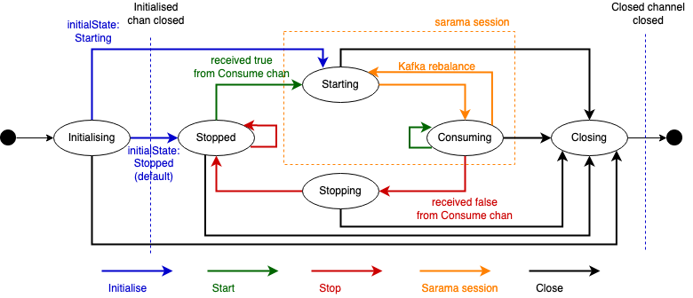

# dp-kafka

Kafka client wrapper using channels to abstract kafka consumers and producers. This library is built on top of [Sarama](https://github.com/Shopify/sarama)

## Configuration

By default, the library assumes plaintext connections,
unless the configuration argument has a non-nil `SecurityConfig` field.

## Life-cycle



### Creation

Kafka producers and consumers can be created with constructors that accept the required channels and configuration. You may create the channels using `CreateProducerChannels` and `CreateConsumerChannels` respectively:

```go
	// Create Producer with channels and config
	pChannels := kafka.CreateProducerChannels()
	pConfig := &kafka.ProducerConfig{MaxMessageBytes: &cfg.KafkaMaxBytes}
	producer, err := kafka.NewProducer(ctx, cfg.Brokers, cfg.ProducedTopic, pChannels, pConfig)
```

```go
import (
	kafkaConfig "github.com/ONSdigital/dp-kafka/v3/config"
)

// Create kafka consumer, passing relevant config
cg, err := consumer.NewConsumerGroup(ctx, &kafkaConfig.ConsumerGroupConfig{
	BrokerAddrs:  cfg.Brokers,       // compulsory
	Topic:        cfg.ConsumedTopic, // compulsory
	GroupName:    cfg.ConsumedGroup, // compulsory
	KafkaVersion: &cfg.KafkaVersion,
	NumWorkers:   &cfg.KafkaParallelMessages,
})
```

For consumers, you can specify the batch size that determines the number of messages to be stored in the Upstream channel. It is recommended to provide a batch size equal to the number of parallel messages that are consumed.

You can provide an optional config parameter to the constructor (`ProducerConfig` and `ConsumerGroupConfig`). Any provided configuration will overwrite the default sarama config, or you can pass a nil value to use the default sarama config.

The constructor tries to initialise the producer/consumer by creating the underlying Sarama client, but failing to initialise it is not considered a fatal error, hence the constructor will not error.

please, note that if you do not provide the necessary channels, an error will be returned by the constructors, containing the information of the channels that are missing, which must be considered fatal.

### Initialisation

If the producer/consumer can establish a connection with the Kafka cluster, it will be initialised at creation time, which is usually the case. But it might not be able to do so, for example if the kafka cluster is not running. If a producer/consumer is not initialised, it cannot contact the kafka broker, and it cannot send or receive any message. Any attempt to send a message in this state will result in an error being sent to the Errors channel.

An uninitialised producer/consumer will try to initialise later, asynchronously, in a retry loop following an exponential backoff strategy. You may also try to initialise it calling `Initialise()`. In any case, when the initialisation succeeds, the initialisation loop will exit, and it will start producing/consuming.

You can check if a producer/consumer is initialised by calling `IsInitialised()` or wait for it to be initialised by waiting for the Ready channel to be closed, like so:

```go
	// wait in a parallel go-routine
	go func() {
		<-channels.Ready
		doStuff()
	}()
```

```go
	// block until kafka is initialised
	<-channels.Ready
	doStuff()
```

Waiting for this channel is a convenient hook, but not a necessary requirement.

Note that initialised consumers will be in 'Stopped' state until they receive 'true' from the Consume channel.

### Message production

Messages are sent to Kafka by sending them to a producer Output channel, as byte arrays:

```go
	// send message
	pChannels.Output <- []byte(msg)
```

### Message consumption

Messages can be consumed by creating an infinite consumption loop. Once a message has finished being processed, you need to call `Commit()`, so that Sarama releases the go-routine consuming a message and Kafka knows that the message does not need to be delivered again (marks the message, and commits the offset):

```go
// consumer loop
func consume(upstream chan kafka.Message) {
	for {
		msg := <-upstream
		doStuff(msg)
		msg.Commit()
	}
}
```

You may create a single go-routine to consume messages sequentially, or multiple parallel go-routines (workers) to consume them concurrently:

```go
	// single consume go-routine
	go consume(channels.Upstream)
```

```go
	// multiple workers to consume messages in parallel
	for w := 1; w <= cfg.KafkaParallelMessages; w++ {
		go consume(channels.Upstream)
	}
```

You can consume up to as may messages in parallel as partitions are assigned to your consumer, more info in the deep dive section.

Note that messages will only be consumed when the consumer is in 'Consuming' state.

#### Message consumption deep dive


Sarama creates as many go-routines as partitions are assigned to the consumer, for the topic being consumed.

For example, if we have a topic with 60 partitions and we have 2 instances of a service that consumes that topic running at the same time, kafka will assign 30 partitions to each one.

Then Sarama will create 30 parallel go-routines, which this library uses in order to send messages to the upstream channel. Each go-routine waits for the message to finish being processed by waiting for the message-specific `upstreamDone` channel to be closed, like so:

```go
	channels.Upstream <- msg
	<-msg.upstreamDone
```

The consumer can consume messages from the Upstream channel in parallel, up to the maximum number of partitions that Sarama allocated to the consumer. In the example above, that would be a maximum of 30 messages in parallel.

Each Sarama consumption go routine exists only during a particular session. Sessions are periodically destroyed and created by Sarama, according to Kafka events like a cluster re-balance (where the number of partitions assigned to a consumer may change). It is important that messages are released as soon as possible when this happens. The default message consumption timeout is 10 seconds in this scenario (determined by `config.Consumer.Group.Session.Timeout`).

When a session finishes, we call Consume() again, which tries to establish a new session. If an error occurs trying to establish a new session, it will be retried following an exponential backoff strategy.

### Start/Stop consumer

The consumer can be stopped by sending a 'false' value to the Consume channel, and it can be started by sending a 'true' value:

- Start a consumer
```go
channels.Consume <- true
```

- Stop a consumer
```go
channels.Consume <- false
```

When a consumer receives the `false` value from the Consume channel, it will be set to `Stopping` state, it will finish processing any in-flight message and then finish the Sarama session.

Then it will go on a `Stopped` stationary state, where it will wait until it is started or closed.

When a `true` value is received form the Consume channel by a stopped consumer, the consumer will bet set to `Starting` state, a new Sarama session will be created and it will go back to `Consuming` state once its ready to receive messages.

Sending `true` to a consumer in `Starting`/`Consuming` state, or `false` to a consumer in `Stopping`/`Stopped` state ha no effect.


### Closing

Producers can be closed by calling the `Close` method.

For graceful handling of Closing consumers, it is advised to use the `StopListeningToConsumer` method prior to the `Close` method. This will allow inflight messages to be completed and successfully call commit so that the message does not get replayed once the application restarts.

The `Closer` channel is used to signal to all the loops that they need to exit because the consumer is being closed.

After successfully closing a producer or consumer, the corresponding `Closed` channel is closed.

## Health-check

The health status of a consumer or producer can be obtained by calling `Checker` method, which updates the provided CheckState structure with the relevant information:

```go
check, err = cli.Checker(ctx)
```

- If a broker cannot be reached, the Status is set to CRITICAL.
- If all brokers can be reached, but a broker does not provide the expected topic metadata, the Status is set to WARNING.
- If all brokers can be reached and return the expected topic metadata, we try to initialise the consumer/producer. If it was already initialised, or the initialisation is successful, the Status is set to OK.

## Examples

See the [examples](examples/README.md) below for some typical usages of this library.

- [Producer example](examples/producer/main.go) [TLS enabled]
- [Sequential consumer example](examples/consumer-sequential/main.go) [TLS enabled]
- [Concurrent consumer example](examples/consumer-concurrent/main.go)

## Testing

Some mocks are provided, so that you can test your code interactions with this library. [More details here.](kafkatest/README.md)
